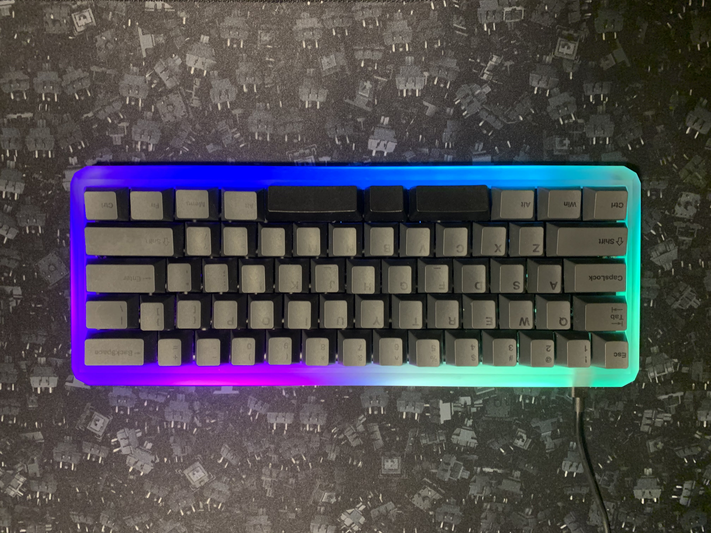

# SplitSpace
A regular 60% keyboard with the spacebar split into three buttons

### Motivation
Thumbs are our most dextrous digits, so why would we ever limit them to one button (let alone one SHARED button) on a keyboard? Every other finger is assigned numerous keys... This keyboard is a crude attempt to remedy that. It doesn't fix a lot of other issues with keyboards, but those are separate projects.

(My old keyboard PCB broke and I needed a replacement)

### Design
- fits in KBDFans 5 degree 60% case (the case I owned at the time of designing this PCB)
- hotswappable with MX style switches
- USB Type-C
- RGB underglow
- 3 spacebar keys
  - 2.25u, 1.25, and 2.75u (shift and modifier keys in ANSI layout keycaps)

